<p align="center">
  
</p>

<p align="center">
  <a href="https://git.io/typing-svg">
    
  </a>
</p>

<p align="center">
  <a href="https://github.com/Tushar-Mittal-09">
    
  </a>
  <a href="https://www.linkedin.com/in/tushar-mittal-a55b1429b">
    
  </a>
  <a href="mailto:tusharmittal597@gmail.com">
    
  </a>
</p>

---

### `> whoami`

```yaml
name     : Tushar Mittal
role     : Full Stack Developer + AI/ML Engineer
github   : Tushar-Mittal-09

currently:
  - Building full-stack web applications with MERN stack
  - Developing AI-powered platforms with RAG and LLMs
  - Working with multi-agent systems using LangGraph
  - Exploring Generative AI and local LLM inference
  - Improving DSA and software engineering skills

interests:
  - Full-stack development
  - Machine Learning & Generative AI
  - Retrieval-Augmented Generation (RAG)
  - Multi-agent AI systems
  - REST APIs & microservices
```

---

## ⚡ Tech Arsenal

<table>
<tr>
<td align="center" width="50%">

**🔤 Programming**


</td>
<td align="center" width="50%">

**🎨 Frontend**


</td>
</tr>
<tr>
<td align="center" width="50%">

**⚙️ Backend**


</td>
<td align="center" width="50%">

**🗄️ Databases**


</td>
</tr>
<tr>
<td align="center" width="50%">

**🤖 AI / ML**


</td>
<td align="center" width="50%">

**🛠️ Tools & DevOps**


</td>
</tr>
</table>

---

## 🤖 AI & Machine Learning

<p align="center">
  <em>Exploring practical ways to integrate Machine Learning and Generative AI into modern full-stack applications.</em>
</p>

<p align="center">
  
  
  
  
  
  
  
  
</p>

---

## 🚀 Featured Projects

<table>
<tr>
<td width="50%">

### 🧠 DocuMind AI — RAG Platform

> Privacy-first, fully local AI-powered document intelligence platform. Upload PDFs, build vector embeddings, and chat with your documents — all running 100% offline using Ollama and FAISS.

`Next.js` `Express` `Flask` `MongoDB` `Ollama` `FAISS` `TypeScript` `Python`

<a href="https://github.com/Tushar-Mittal-09/DocumentAI-Rag-Project">
  
</a>

</td>
<td width="50%">

### 🔬 ARIP — Multi-Agent Research Platform

> Enterprise-grade AI research system powered by a 14-agent LangGraph pipeline. Automates planning, web research, fact-checking, citation generation, report writing, and self-improving revision loops.

`React` `FastAPI` `LangGraph` `PostgreSQL` `FAISS` `Docker` `TypeScript` `Python`

<a href="https://github.com/Tushar-Mittal-09/ARIP-MultiAgentSystem">
  
</a>

</td>
</tr>
<tr>
<td width="50%">

### 🌿 EcoTrack — Smart Waste Management

> AI-powered full-stack MERN platform for smart waste management. Features AI waste classification, real-time status tracking, eco-points reward system, role-based dashboards, and an AI chatbot for recycling guidance.

`React` `Express.js` `MongoDB` `OpenAI` `TailwindCSS` `Node.js` `JWT`

<a href="https://github.com/Tushar-Mittal-09/Eco-Track-Website">
  
</a>

</td>
<td width="50%">

### 🎓 SkillBridge AI — Internship Platform

> Full-stack web application bridging students and recruiters. Built with Express.js, EJS, MongoDB, JWT authentication, role-based access control, GitHub API integration, and an async background processing queue.

`Node.js` `Express.js` `EJS` `MongoDB` `JWT` `GitHub API` `Bootstrap`

<a href="https://github.com/Tushar-Mittal-09/SkillBridgeAi">
  
</a>

</td>
</tr>
</table>

---

## 🐍 Watch My Contributions Get Eaten

<p align="center">
  <picture>
    <source media="(prefers-color-scheme: dark)" srcset="https://raw.githubusercontent.com/Tushar-Mittal-09/Tushar-Mittal-09/output/github-contribution-grid-snake-dark.svg" />
    <source media="(prefers-color-scheme: light)" srcset="https://raw.githubusercontent.com/Tushar-Mittal-09/Tushar-Mittal-09/output/github-contribution-grid-snake.svg" />
    
  </picture>
</p>

---


## 📊 GitHub Analytics

<div align="center">

<table border="0">
<tr>

<td width="50%" align="center">



</td>

<td width="50%" align="center">



</td>

</tr>
</table>

</div>
---

## 🔭 Currently Exploring

<p align="center">
  
  
  
  
  
  
  
  
</p>

---

<p align="center">
  
</p>

<p align="center">
  <em>「 Build. Learn. Improve. Repeat. 」</em>
</p>

<p align="center">
  
</p>
